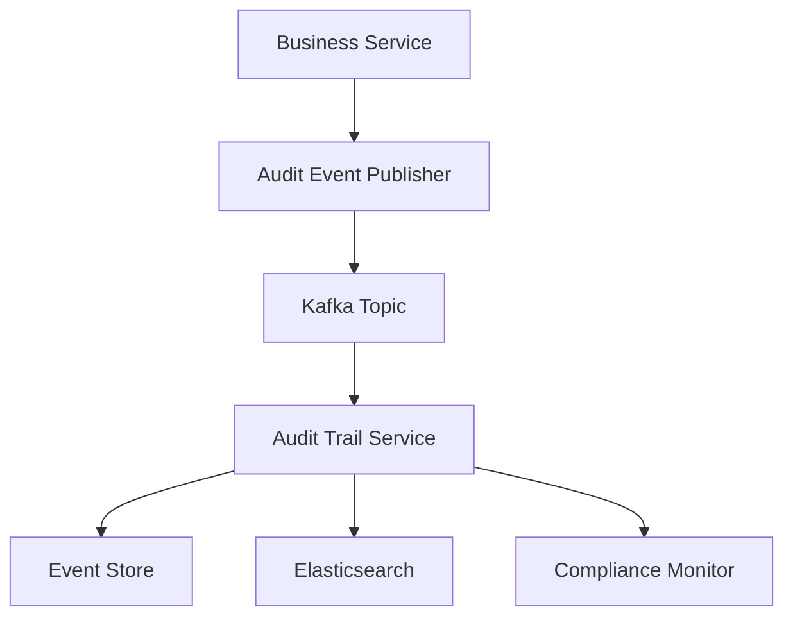

# Service Integration Contracts for Audit Trail Service

## Overview

This document defines the integration contracts, patterns, and requirements for all ERP services to integrate with the Audit Trail Service. It ensures consistent audit event generation, correlation, and compliance across the entire system.

## Integration Architecture

### Event-Driven Architecture Pattern



### Core Integration Components

1. **Audit Event Publisher** - Publishes audit events to Kafka
2. **Event Correlation Manager** - Manages correlation IDs across services
3. **Circuit Breaker** - Handles audit service failures gracefully
4. **Retry Mechanism** - Ensures reliable event delivery
5. **Fallback Logger** - Local logging when audit service unavailable

## Service Integration Requirements

### Mandatory Integration Points

All ERP services MUST implement audit event generation for the following operations:

#### CRUD Operations
- **CREATE**: Entity creation events
- **UPDATE**: Entity modification events  
- **DELETE**: Entity deletion events
- **READ**: Sensitive data access events (configurable)

#### Business Process Events
- **APPROVE**: Approval workflow events
- **REJECT**: Rejection workflow events
- **PROCESS**: Business process execution events
- **COMPLETE**: Process completion events

#### Document Management Events
- **ATTACH**: Document attachment events
- **DETACH**: Document removal events
- **VIEW**: Document access events (for sensitive documents)
- **DOWNLOAD**: Document download events

### Integration Contract Interface

```java
/**
 * Audit Event Publisher Interface
 * All services must implement or use this interface for audit event publishing
 */
public interface AuditEventPublisher {
    
    /**
     * Publish a business audit event
     * @param event The audit event to publish
     * @return CompletableFuture<Void> for async processing
     */
    CompletableFuture<Void> publishAuditEvent(AuditTrailEvent event);
    
    /**
     * Publish a compliance audit event
     * @param event The compliance audit event to publish
     * @return CompletableFuture<Void> for async processing
     */
    CompletableFuture<Void> publishComplianceEvent(ComplianceAuditEvent event);
    
    /**
     * Publish multiple events in batch
     * @param events List of events to publish
     * @return CompletableFuture<Void> for async processing
     */
    CompletableFuture<Void> publishBatchEvents(List<DomainEvent> events);
}
```

### Event Publishing Implementation Pattern

```java
@Component
@Slf4j
public class StandardAuditEventPublisher implements AuditEventPublisher {
    
    private final KafkaTemplate<String, Object> kafkaTemplate;
    private final CircuitBreaker circuitBreaker;
    private final RetryTemplate retryTemplate;
    private final FallbackAuditLogger fallbackLogger;
    
    @Override
    public CompletableFuture<Void> publishAuditEvent(AuditTrailEvent event) {
        return circuitBreaker.executeSupplier(() -> 
            retryTemplate.execute(context -> {
                try {
                    // Enrich event with correlation context
                    enrichEventWithContext(event);
                    
                    // Publish to appropriate Kafka topic
                    String topic = determineTopicForEvent(event);
                    kafkaTemplate.send(topic, event.getAggregateId(), event);
                    
                    log.debug("Published audit event: {}", event.getEventId());
                    return CompletableFuture.completedFuture(null);
                    
                } catch (Exception e) {
                    log.error("Failed to publish audit event: {}", event.getEventId(), e);
                    fallbackLogger.logEvent(event);
                    throw e;
                }
            })
        );
    }
    
    private void enrichEventWithContext(AuditTrailEvent event) {
        // Add correlation ID from MDC
        String correlationId = MDC.get("correlationId");
        if (correlationId != null) {
            event.setCorrelationId(UUID.fromString(correlationId));
        }
        
        // Add user context
        String userId = SecurityUtils.getCurrentUserId();
        event.setUserId(userId);
        
        // Add session context
        String sessionId = SecurityUtils.getCurrentSessionId();
        event.setSessionId(sessionId);
        
        // Add IP address
        String ipAddress = RequestContextUtils.getCurrentIpAddress();
        event.setIpAddress(ipAddress);
        
        // Add user agent
        String userAgent = RequestContextUtils.getCurrentUserAgent();
        event.setUserAgent(userAgent);
    }
}
```

## Service-Specific Integration Patterns

### Payment Service Integration

```java
@Service
@Transactional
public class PaymentServiceImpl implements PaymentService {
    
    private final PaymentRepository paymentRepository;
    private final AuditEventPublisher auditEventPublisher;
    
    @Override
    public Payment save(Payment payment) {
        Payment savedPayment = paymentRepository.save(payment);
        
        // Publish audit event
        AuditTrailEvent auditEvent = AuditTrailEvent.builder()
            .aggregateType("Payment")
            .aggregateId(savedPayment.getId().toString())
            .eventType(payment.getId() == null ? "CREATED" : "UPDATED")
            .newValues(convertToJson(savedPayment))
            .oldValues(payment.getId() != null ? convertToJson(findOriginal(payment.getId())) : null)
            .build();
            
        auditEventPublisher.publishAuditEvent(auditEvent);
        
        return savedPayment;
    }
    
    @Override
    public void delete(Long id) {
        Payment payment = paymentRepository.findById(id)
            .orElseThrow(() -> new EntityNotFoundException("Payment not found"));
            
        paymentRepository.deleteById(id);
        
        // Publish deletion audit event
        AuditTrailEvent auditEvent = AuditTrailEvent.builder()
            .aggregateType("Payment")
            .aggregateId(id.toString())
            .eventType("DELETED")
            .oldValues(convertToJson(payment))
            .build();
            
        auditEventPublisher.publishAuditEvent(auditEvent);
    }
}
```

### Asset Management Service Integration

```java
@Service
@Transactional
public class AssetRegistrationServiceImpl implements AssetRegistrationService {
    
    private final AssetRegistrationRepository assetRepository;
    private final AuditEventPublisher auditEventPublisher;
    
    @Override
    public AssetRegistration processDepreciation(Long assetId, DepreciationRequest request) {
        AssetRegistration asset = assetRepository.findById(assetId)
            .orElseThrow(() -> new EntityNotFoundException("Asset not found"));
            
        AssetRegistration originalAsset = asset.clone();
        
        // Perform depreciation calculation
        asset.setNetBookValue(calculateNewNetBookValue(asset, request));
        asset.setAccumulatedDepreciation(calculateAccumulatedDepreciation(asset, request));
        
        AssetRegistration savedAsset = assetRepository.save(asset);
        
        // Publish compliance audit event for IFRS16
        ComplianceAuditEvent complianceEvent = ComplianceAuditEvent.builder()
            .aggregateType("AssetRegistration")
            .aggregateId(assetId.toString())
            .eventType("DEPRECIATION_PROCESSED")
            .complianceType("IFRS16")
            .regulationReference("IFRS 16.30")
            .complianceStatus("COMPLIANT")
            .oldValues(convertToJson(originalAsset))
            .newValues(convertToJson(savedAsset))
            .auditDetails(Map.of(
                "depreciationMethod", request.getDepreciationMethod(),
                "depreciationAmount", request.getDepreciationAmount(),
                "calculationDate", request.getCalculationDate()
            ))
            .build();
            
        auditEventPublisher.publishComplianceEvent(complianceEvent);
        
        return savedAsset;
    }
}
```

## Cross-Service Event Correlation

### Correlation ID Management

```java
@Component
public class CorrelationIdManager {
    
    private static final String CORRELATION_ID_HEADER = "X-Correlation-ID";
    private static final String MDC_CORRELATION_KEY = "correlationId";
    
    /**
     * Generate new correlation ID for new transactions
     */
    public String generateCorrelationId() {
        String correlationId = UUID.randomUUID().toString();
        MDC.put(MDC_CORRELATION_KEY, correlationId);
        return correlationId;
    }
    
    /**
     * Extract correlation ID from HTTP headers
     */
    public String extractCorrelationId(HttpServletRequest request) {
        String correlationId = request.getHeader(CORRELATION_ID_HEADER);
        if (correlationId == null) {
            correlationId = generateCorrelationId();
        } else {
            MDC.put(MDC_CORRELATION_KEY, correlationId);
        }
        return correlationId;
    }
    
    /**
     * Propagate correlation ID to downstream services
     */
    public void propagateCorrelationId(HttpHeaders headers) {
        String correlationId = MDC.get(MDC_CORRELATION_KEY);
        if (correlationId != null) {
            headers.set(CORRELATION_ID_HEADER, correlationId);
        }
    }
}
```

### API Gateway Integration

```java
@Component
public class AuditTrailFilter implements Filter {
    
    private final CorrelationIdManager correlationIdManager;
    
    @Override
    public void doFilter(ServletRequest request, ServletResponse response, FilterChain chain) 
            throws IOException, ServletException {
        
        HttpServletRequest httpRequest = (HttpServletRequest) request;
        
        try {
            // Extract or generate correlation ID
            String correlationId = correlationIdManager.extractCorrelationId(httpRequest);
            
            // Add to response headers for client tracking
            HttpServletResponse httpResponse = (HttpServletResponse) response;
            httpResponse.setHeader("X-Correlation-ID", correlationId);
            
            chain.doFilter(request, response);
            
        } finally {
            // Clean up MDC
            MDC.clear();
        }
    }
}
```

## Circuit Breaker and Resilience Patterns

### Circuit Breaker Configuration

```java
@Configuration
public class AuditCircuitBreakerConfig {
    
    @Bean
    public CircuitBreaker auditCircuitBreaker() {
        return CircuitBreaker.ofDefaults("audit-service")
            .toBuilder()
            .failureRateThreshold(50)
            .waitDurationInOpenState(Duration.ofSeconds(30))
            .slidingWindowSize(10)
            .minimumNumberOfCalls(5)
            .build();
    }
    
    @Bean
    public RetryTemplate auditRetryTemplate() {
        return RetryTemplate.builder()
            .maxAttempts(3)
            .exponentialBackoff(1000, 2, 10000)
            .retryOn(Exception.class)
            .build();
    }
}
```

### Fallback Logging Strategy

```java
@Component
@Slf4j
public class FallbackAuditLogger {
    
    private final ObjectMapper objectMapper;
    
    /**
     * Log audit event locally when audit service is unavailable
     */
    public void logEvent(DomainEvent event) {
        try {
            String eventJson = objectMapper.writeValueAsString(event);
            
            // Log to dedicated audit fallback logger
            Logger auditFallbackLogger = LoggerFactory.getLogger("AUDIT_FALLBACK");
            auditFallbackLogger.info("FALLBACK_AUDIT_EVENT: {}", eventJson);
            
            // Also store in local database for later replay
            storeFallbackEvent(event);
            
        } catch (Exception e) {
            log.error("Failed to log fallback audit event", e);
        }
    }
    
    private void storeFallbackEvent(DomainEvent event) {
        // Store in local database table for later replay when audit service recovers
        // This ensures no audit events are lost during service outages
    }
}
```

## Integration Testing Strategy

### Contract Testing

```java
@SpringBootTest
@TestPropertySource(properties = {
    "audit.kafka.enabled=false",
    "audit.fallback.enabled=true"
})
class AuditIntegrationContractTest {
    
    @Autowired
    private PaymentService paymentService;
    
    @MockBean
    private AuditEventPublisher auditEventPublisher;
    
    @Test
    void shouldPublishAuditEventOnPaymentCreation() {
        // Given
        Payment payment = createTestPayment();
        
        // When
        Payment savedPayment = paymentService.save(payment);
        
        // Then
        ArgumentCaptor<AuditTrailEvent> eventCaptor = ArgumentCaptor.forClass(AuditTrailEvent.class);
        verify(auditEventPublisher).publishAuditEvent(eventCaptor.capture());
        
        AuditTrailEvent capturedEvent = eventCaptor.getValue();
        assertThat(capturedEvent.getAggregateType()).isEqualTo("Payment");
        assertThat(capturedEvent.getEventType()).isEqualTo("CREATED");
        assertThat(capturedEvent.getAggregateId()).isEqualTo(savedPayment.getId().toString());
    }
    
    @Test
    void shouldHandleAuditServiceFailureGracefully() {
        // Given
        Payment payment = createTestPayment();
        when(auditEventPublisher.publishAuditEvent(any()))
            .thenReturn(CompletableFuture.failedFuture(new RuntimeException("Audit service down")));
        
        // When & Then - should not throw exception
        assertDoesNotThrow(() -> paymentService.save(payment));
    }
}
```

### End-to-End Integration Testing

```java
@SpringBootTest
@Testcontainers
class AuditTrailEndToEndIntegrationTest {
    
    @Container
    static KafkaContainer kafka = new KafkaContainer(DockerImageName.parse("confluentinc/cp-kafka:latest"));
    
    @Container
    static ElasticsearchContainer elasticsearch = new ElasticsearchContainer("docker.elastic.co/elasticsearch/elasticsearch:8.5.0");
    
    @Test
    void shouldCreateCompleteAuditTrailForBusinessProcess() {
        // Given - Create a payment that goes through approval workflow
        Payment payment = createTestPayment();
        
        // When - Execute business process
        Payment savedPayment = paymentService.save(payment);
        PaymentApproval approval = approvalService.approve(savedPayment.getId(), "manager");
        Settlement settlement = settlementService.settle(savedPayment.getId());
        
        // Then - Verify complete audit trail exists
        await().atMost(Duration.ofSeconds(30)).untilAsserted(() -> {
            List<AuditTrailEvent> auditTrail = auditTrailService.getAuditTrail(
                "Payment", savedPayment.getId().toString(), null, null);
                
            assertThat(auditTrail).hasSize(3);
            assertThat(auditTrail.get(0).getEventType()).isEqualTo("CREATED");
            assertThat(auditTrail.get(1).getEventType()).isEqualTo("APPROVED");
            assertThat(auditTrail.get(2).getEventType()).isEqualTo("SETTLED");
            
            // Verify correlation ID is consistent across all events
            String correlationId = auditTrail.get(0).getCorrelationId().toString();
            assertThat(auditTrail).allMatch(event -> 
                event.getCorrelationId().toString().equals(correlationId));
        });
    }
}
```

## Performance Considerations

### Async Event Publishing

```java
@Configuration
@EnableAsync
public class AsyncAuditConfig {
    
    @Bean(name = "auditTaskExecutor")
    public TaskExecutor auditTaskExecutor() {
        ThreadPoolTaskExecutor executor = new ThreadPoolTaskExecutor();
        executor.setCorePoolSize(5);
        executor.setMaxPoolSize(20);
        executor.setQueueCapacity(100);
        executor.setThreadNamePrefix("audit-");
        executor.initialize();
        return executor;
    }
}

@Service
public class AsyncAuditEventPublisher {
    
    @Async("auditTaskExecutor")
    public CompletableFuture<Void> publishEventAsync(AuditTrailEvent event) {
        // Async event publishing logic
        return auditEventPublisher.publishAuditEvent(event);
    }
}
```

### Batch Event Publishing

```java
@Component
public class BatchAuditEventPublisher {
    
    private final List<DomainEvent> eventBuffer = new ArrayList<>();
    private final Object bufferLock = new Object();
    
    @Scheduled(fixedDelay = 5000) // Flush every 5 seconds
    public void flushEventBuffer() {
        List<DomainEvent> eventsToFlush;
        
        synchronized (bufferLock) {
            if (eventBuffer.isEmpty()) {
                return;
            }
            eventsToFlush = new ArrayList<>(eventBuffer);
            eventBuffer.clear();
        }
        
        auditEventPublisher.publishBatchEvents(eventsToFlush);
    }
    
    public void bufferEvent(DomainEvent event) {
        synchronized (bufferLock) {
            eventBuffer.add(event);
            
            // Flush immediately if buffer is full
            if (eventBuffer.size() >= 100) {
                flushEventBuffer();
            }
        }
    }
}
```

## Security and Authorization

### Audit Event Security

```java
@Component
public class AuditEventSecurityEnforcer {
    
    /**
     * Sanitize sensitive data before audit logging
     */
    public AuditTrailEvent sanitizeEvent(AuditTrailEvent event) {
        // Remove sensitive fields from old/new values
        if (event.getOldValues() != null) {
            event.setOldValues(sanitizeJsonObject(event.getOldValues()));
        }
        if (event.getNewValues() != null) {
            event.setNewValues(sanitizeJsonObject(event.getNewValues()));
        }
        
        return event;
    }
    
    private JsonNode sanitizeJsonObject(JsonNode jsonNode) {
        ObjectNode sanitized = jsonNode.deepCopy();
        
        // List of sensitive fields to mask
        List<String> sensitiveFields = Arrays.asList(
            "password", "ssn", "creditCardNumber", "bankAccount", "personalId"
        );
        
        sensitiveFields.forEach(field -> {
            if (sanitized.has(field)) {
                sanitized.put(field, "***MASKED***");
            }
        });
        
        return sanitized;
    }
}
```

## Monitoring and Observability

### Integration Health Monitoring

```java
@Component
public class AuditIntegrationHealthIndicator implements HealthIndicator {
    
    private final AuditEventPublisher auditEventPublisher;
    private final CircuitBreaker circuitBreaker;
    
    @Override
    public Health health() {
        try {
            // Check circuit breaker state
            CircuitBreaker.State state = circuitBreaker.getState();
            if (state == CircuitBreaker.State.OPEN) {
                return Health.down()
                    .withDetail("circuitBreaker", "OPEN")
                    .withDetail("reason", "Audit service unavailable")
                    .build();
            }
            
            // Test audit event publishing
            AuditTrailEvent testEvent = createHealthCheckEvent();
            auditEventPublisher.publishAuditEvent(testEvent).get(5, TimeUnit.SECONDS);
            
            return Health.up()
                .withDetail("circuitBreaker", state.toString())
                .withDetail("lastCheck", Instant.now())
                .build();
                
        } catch (Exception e) {
            return Health.down()
                .withDetail("error", e.getMessage())
                .withDetail("circuitBreaker", circuitBreaker.getState().toString())
                .build();
        }
    }
}
```

### Metrics and Monitoring

```java
@Component
public class AuditIntegrationMetrics {
    
    private final Counter auditEventsPublished;
    private final Counter auditEventsFailed;
    private final Timer auditEventPublishTime;
    
    public AuditIntegrationMetrics(MeterRegistry meterRegistry) {
        this.auditEventsPublished = Counter.builder("audit.events.published")
            .description("Number of audit events published")
            .tag("service", "audit-integration")
            .register(meterRegistry);
            
        this.auditEventsFailed = Counter.builder("audit.events.failed")
            .description("Number of failed audit event publications")
            .tag("service", "audit-integration")
            .register(meterRegistry);
            
        this.auditEventPublishTime = Timer.builder("audit.events.publish.time")
            .description("Time taken to publish audit events")
            .tag("service", "audit-integration")
            .register(meterRegistry);
    }
    
    public void recordEventPublished() {
        auditEventsPublished.increment();
    }
    
    public void recordEventFailed() {
        auditEventsFailed.increment();
    }
    
    public Timer.Sample startPublishTimer() {
        return Timer.start(auditEventPublishTime);
    }
}
```

## Migration and Backward Compatibility

### Gradual Migration Strategy

1. **Phase 1**: Deploy audit integration infrastructure
2. **Phase 2**: Enable audit events for new services
3. **Phase 3**: Migrate existing services one by one
4. **Phase 4**: Enable compliance monitoring
5. **Phase 5**: Deprecate old audit mechanisms

### Backward Compatibility

```java
@Component
public class LegacyAuditBridge {
    
    private final AuditEventPublisher newAuditPublisher;
    
    /**
     * Bridge method for legacy audit calls
     */
    @Deprecated
    public void logAuditEvent(String entityType, String entityId, String action, String userId) {
        // Convert legacy audit call to new audit event format
        AuditTrailEvent event = AuditTrailEvent.builder()
            .aggregateType(entityType)
            .aggregateId(entityId)
            .eventType(mapLegacyAction(action))
            .userId(userId)
            .build();
            
        newAuditPublisher.publishAuditEvent(event);
    }
    
    private String mapLegacyAction(String legacyAction) {
        // Map legacy action names to new event types
        switch (legacyAction.toUpperCase()) {
            case "INSERT": return "CREATED";
            case "UPDATE": return "UPDATED";
            case "DELETE": return "DELETED";
            default: return legacyAction.toUpperCase();
        }
    }
}
```

## Conclusion

This service integration contract ensures:

1. **Consistency** - All services follow the same audit event patterns
2. **Reliability** - Circuit breakers and fallback mechanisms prevent failures
3. **Traceability** - Correlation IDs enable end-to-end transaction tracking
4. **Compliance** - Standardized compliance event generation
5. **Performance** - Async processing and batching optimize performance
6. **Security** - Sensitive data sanitization and access controls
7. **Observability** - Comprehensive monitoring and health checks
8. **Maintainability** - Clear contracts and testing strategies

All ERP services must implement these integration patterns to ensure comprehensive audit trail coverage and regulatory compliance.
