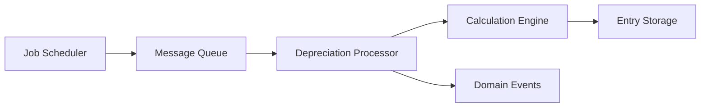

# Depreciation Bounded Context

## Context Overview

The Depreciation bounded context is responsible for automated depreciation calculations, batch processing, and net book value tracking across all depreciable assets. This context provides the calculation engine for various depreciation methods and manages the depreciation lifecycle through batch job orchestration.

## Business Responsibilities

- Automated depreciation calculation engine
- Batch job orchestration and management
- Multiple depreciation method support
- Depreciation period management
- Net book value tracking and reporting
- Depreciation batch processing and scheduling
- Depreciation method configuration and maintenance

## Core Domain Entities

### Aggregate Roots

#### DepreciationJob
- **Purpose**: Central aggregate for batch depreciation processing
- **Key Attributes**:
  - `jobIdentifier` (unique job ID)
  - `timeOfCommencement` (job start time)
  - `depreciationPeriod` (processing period)
  - `jobStatus` (current status)
  - `numberOfBatches` (batch count)
- **Business Rules**:
  - Job identifier must be unique
  - Jobs cannot overlap for same period
  - Status transitions must follow defined workflow

#### DepreciationEntry
- **Purpose**: Individual asset depreciation calculations
- **Key Attributes**:
  - `depreciationAmount` (calculated depreciation)
  - `assetNumber` (asset reference)
  - `netBookValue` (remaining value)
  - `depreciationPeriodStartDate` (period start)
  - `depreciationPeriodEndDate` (period end)
- **Business Rules**:
  - Depreciation amount must be non-negative
  - Net book value cannot be negative
  - Period dates must be valid and sequential

### Supporting Entities

#### DepreciationPeriod
- **Purpose**: Depreciation period definition and management
- **Key Attributes**: `periodCode`, `startDate`, `endDate`, `periodStatus`
- **Relationship**: One-to-many with DepreciationJob

#### DepreciationMethod
- **Purpose**: Depreciation calculation method configuration
- **Key Attributes**: `methodName`, `methodCode`, `calculationType`
- **Relationship**: Referenced by asset categories and entries

#### NetBookValueEntry
- **Purpose**: Asset net book value tracking
- **Key Attributes**: `netBookValue`, `assetNumber`, `valuationDate`
- **Relationship**: Generated from depreciation calculations

#### DepreciationBatchSequence
- **Purpose**: Batch processing sequence management
- **Key Attributes**: `batchSequenceNumber`, `processedItems`, `batchStatus`
- **Relationship**: Many-to-one with DepreciationJob

## External Dependencies

### Asset Management Context
- **AssetRegistration**: Source asset data for depreciation calculations
- **AssetCategory**: Depreciation method assignment and asset classification

### Financial Core Context
- **ServiceOutlet**: Location-based depreciation processing
- **SettlementCurrency**: Multi-currency depreciation support

### Shared Kernel
- **FiscalMonth**: Depreciation period alignment
- **FiscalQuarter**: Quarterly depreciation processing
- **FiscalYear**: Annual depreciation cycles
- **ApplicationUser**: Job execution and authorization

## Context Boundaries

### What's Inside the Context
- All depreciation calculation logic and algorithms
- Batch job orchestration and management
- Depreciation period lifecycle management
- Net book value computation and tracking
- Depreciation method configuration
- Batch processing status and monitoring

### What's Outside the Context
- Asset registration and master data (Asset Management)
- Lease-specific ROU depreciation (IFRS16 Leasing)
- Financial transaction processing (Financial Core)
- Depreciation reporting and analytics (Reporting)

## Integration Points

### Inbound Dependencies
- **Asset Data**: Receives asset information from Asset Management Context
- **Fiscal Periods**: Uses fiscal calendar from Shared Kernel
- **Asset Categories**: Receives depreciation method assignments

### Outbound Events
- **DepreciationCalculated**: Published when depreciation is computed
- **DepreciationJobCompleted**: Published when batch job finishes
- **NetBookValueUpdated**: Published when NBV is recalculated
- **DepreciationPeriodClosed**: Published when period processing completes

### Anti-Corruption Layers Required
- **Asset Integration**: Translate asset data to depreciation calculation context
- **Fiscal Calendar Integration**: Adapt fiscal periods to depreciation schedules
- **Currency Integration**: Handle multi-currency depreciation calculations

## Data Consistency Requirements

### Strong Consistency
- Depreciation calculations and amounts
- Net book value computations
- Batch job status and sequencing
- Depreciation period management

### Eventual Consistency
- Cross-context asset data synchronization
- Reporting data propagation
- Audit trail generation

## API Boundaries

### Public Interface
```yaml
POST   /api/depreciation/jobs        # Start depreciation job
GET    /api/depreciation/jobs/{id}   # Get job status
PUT    /api/depreciation/jobs/{id}   # Update job
GET    /api/depreciation/entries     # List entries
POST   /api/depreciation/calculate   # Calculate depreciation
GET    /api/depreciation/periods     # List periods
POST   /api/depreciation/periods     # Create period
GET    /api/depreciation/methods     # List methods
GET    /api/net-book-values          # Get NBV data
```

### Internal Services
- DepreciationJobService
- DepreciationEntryService
- DepreciationPeriodService
- DepreciationMethodService
- NetBookValueService
- DepreciationCalculationService

## Depreciation Calculation Engine

### Supported Methods
1. **Straight Line**: Equal depreciation over useful life
2. **Reducing Balance**: Percentage of net book value
3. **Sum of Years Digits**: Accelerated depreciation method
4. **Units of Production**: Based on usage/production

### Calculation Rules
- **Useful Life**: Based on asset category configuration
- **Residual Value**: Configurable per asset or category
- **Pro-rata Calculations**: For partial periods
- **Currency Handling**: Multi-currency depreciation support

## Batch Processing Architecture

### Job Orchestration


### Batch Processing Rules
1. **Atomicity**: Each batch processes completely or rolls back
2. **Idempotency**: Jobs can be safely rerun
3. **Monitoring**: Real-time job status and progress tracking
4. **Error Handling**: Failed items logged and retried
5. **Performance**: Parallel processing for large asset volumes

## Business Rules and Invariants

1. **Calculation Accuracy**: Depreciation must follow configured methods precisely
2. **Period Integrity**: Depreciation periods cannot overlap or have gaps
3. **Asset Lifecycle**: Fully depreciated assets cannot have additional depreciation
4. **Job Sequencing**: Jobs must process in chronological order
5. **NBV Consistency**: Net book value must equal cost minus accumulated depreciation
6. **Method Consistency**: Depreciation method cannot change mid-lifecycle without revaluation

## Migration Considerations

### Current State
- Depreciation logic mixed with asset management code
- Manual batch processing with limited automation
- Inconsistent depreciation method application

### Target State
- Dedicated depreciation calculation engine
- Fully automated batch processing with monitoring
- Consistent and auditable depreciation calculations

### Migration Risks
- Historical depreciation data validation and migration
- Complex asset-depreciation relationships require careful decoupling
- Batch job scheduling and monitoring system implementation

## Performance Considerations

- **Batch Optimization**: Efficient processing of large asset volumes
- **Parallel Processing**: Multi-threaded calculation engine
- **Caching**: Frequently accessed asset and method data
- **Database Optimization**: Indexed queries for batch processing

## Team Ownership

- **Primary Team**: Asset Accounting Team
- **Domain Expert**: Asset Accountant/Depreciation Specialist
- **Technical Lead**: Senior Developer with batch processing expertise
- **Stakeholders**: Finance Team, Asset Managers, External Auditors
